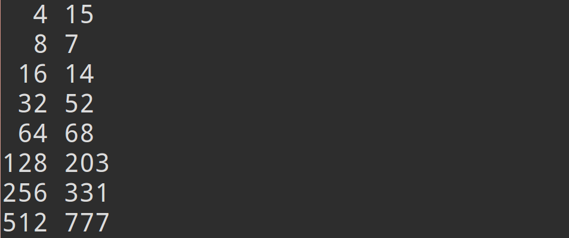

# 实验报告

## 实验名称（测量FFT程序执行时间）

物联1601 201601110208 方缙

## 实验目标

测量FFT程序运行时间，确定其时间复杂度。

## 实验要求

* 采用C/C++编写程序
* 根据自己的机器配置选择合适的输入数据大小 n，至少要测试多个不同的 n (参见思考题)
* 对于相同的 n，建议重复测量30次取平均值作为测量结果 (参见思考题)
* 对测量结果进行分析，确定FFT程序的时间复杂度
* 回答思考题，答案加入到实验报告叙述中合适位置

## 思考题

1. 分析FFT程序的时间复杂度，得到执行时间相对于数据规模 n 的具体公式
2. 根据上一点中的分析，至少要测试多少不同的 n 来确定执行时间公式中的未知数？
3. 重复30次测量然后取平均有什么统计学的依据？

## 实验内容

### FFT算法代码

```c++
#include <complex>
#include <cstdio>
#include<time.h>

#define M_PI 3.14159265358979323846 // Pi constant with double precision

using namespace std;

void separate (complex<double>* a, int n) {
    complex<double>* b = new complex<double>[n/2];  // get temp heap storage
    for(int i=0; i<n/2; i++)
        b[i] = a[i*2+1];
    for(int i=0; i<n/2; i++)
        a[i] = a[i*2];
    for(int i=0; i<n/2; i++)
        a[i+n/2] = b[i];
    delete[] b;
}

void fft2 (complex<double>* X, int N) {
    if(N < 2) {
        // bottom of recursion.
        // Do nothing here, because already X[0] = x[0]
    } else {
        separate(X,N);      // all evens to lower half, all odds to upper half
        fft2(X,     N/2);   // recurse even items
        fft2(X+N/2, N/2);   // recurse odd  items
        // combine results of two half recursions
        for(int k=0; k<N/2; k++) {
            complex<double> e = X[k    ];   // even
            complex<double> o = X[k+N/2];   // odd
            // w is the "twiddle-factor"
            complex<double> w = exp( complex<double>(0,-2.*M_PI*k/N) );
            X[k    ] = e + w * o;
            X[k+N/2] = e - w * o;
        }
    }
}

//计算平均运行时间
clock_t calculateTime(complex<double>* X,int N,int times){
    long int sumt=0;
    for(int j=0;j<times;j++){
        clock_t start=clock();
        fft2(X,N);
        clock_t end=clock();
        sumt+=(end-start);
    }
    sumt/=times;
    return sumt;
}


int main () {
    const int nSamples = 512;
    double nSeconds = 1.0;                      // total time for sampling
    double sampleRate = nSamples / nSeconds;    // n Hz = n / second 
    double freqResolution = sampleRate / nSamples; // freq step in FFT result
    complex<double> x[nSamples];                // storage for sample data
    complex<double> X[nSamples];                // storage for FFT answer
    const int nFreqs = 5;
    double freq[nFreqs] = { 2, 5, 11, 17, 29 }; // known freqs for testing
    
    // generate samples for testing
    for(int i=0; i<nSamples; i++) {
        x[i] = complex<double>(0.,0.);
        for(int j=0; j<nFreqs; j++)
            x[i] += sin( 2*M_PI*freq[j]*i/nSamples );
        X[i] = x[i];       
    }
    
    int sam[8]={4,8,16,32,64,128,256,512};  //8个不同数据规模
    printf("Repeat 30 times\n");
    printf("n\tmeanTime\t\n");
    for(int i=0;i<8;i++){
		long int sumt=calculateTime(X,sam[i],30);
        printf("%d\t%ld\n",sam[i],sumt);
	}
    printf("Repeat 50 times\n");
    printf("n\tmeanTime\t\n");
    for(int i=0;i<8;i++){
		long int sumt=calculateTime(X,sam[i],50);
        printf("%d\t%ld\n",sam[i],sumt);
	}
}
```

### FFT程序时间复杂度分析

观察代码可知，该算法的步骤分为4步

1. 预处理数据。

2. 对左半部分执行fft算法。

3. 对右半部分执行fft算法。

4. 将数组前半部分和后半部分分别继续处理计算。

因为第一步和第四步都是和输入规模n线性相关的，所以合并为k*n。得到如下公式:


根据主定理化简该方程如下：


其中*n*为数据大小，未知数有：

1. *k*
2. *c*

因为公式中有2个未知数，所以至少要有2组不同规模的数据才能求出所有未知数。

## 测试

### 测试平台

在如下机器上进行了测试：

| 部件     | 配置             | 备注   |
| :--------|:----------------:| :-----:|
| CPU      | core i7-6600U    |        |
| 内存     | DDR4 16GB         |        |
| 操作系统 | Ubuntu 16.04 LTS | 运行在虚拟机上 |

### 测试记录

当程序对每个数据规模只测试一次时得到如下运行时间结果




接下来对每个测试样例分别测试30次和50次。


可以看到当只测试一次时，数据规模为4的运行时间接近数据规模为16的运行时间，不符合常识。测量多次取平均值之后得到的结果就相对正常了。所以从统计学角度讲，多次测量取平均值能够避免因偶然情况产生的错误结果或者误差较大的结果。

## 分析和结论

从测试记录来看，FFT程序的执行时间随数据规模增大而增大，但是运行时间的增长率并不是很大，其时间复杂度为O(n*logn)。

运行多次时相同规模的时间会稍有不同但是波动基本上小于100，特别是对于规模较大的数据。应该是因为在计算过程中，产生了分支预测错误，造成了时间上的惩罚。

对于每次测试，不同的数据规模增长也会导致运行时间增长的不同，可能因为数据在高速缓存中的存取以及分支预测的错误导致时间的异常增加。

