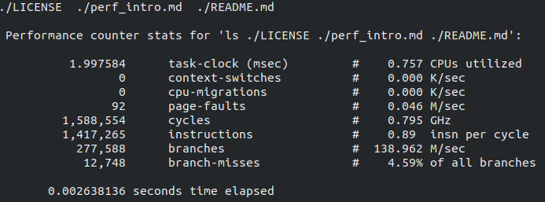

# 实验报告

## 实验名称（多线程FFT程序性能分析和测试）

班级 学号 姓名

## 实验目标

测量多线程FFT程序运行时间，考察线程数目增加时运行时间的变化。

## 实验要求

* 采用C/C++编写程序，选择合适的运行时间测量方法
* 根据自己的机器配置选择合适的输入数据大小 n，保证足够长度的运行时间 
* 对于不同的线程数目，建议至少选择 1 个，2 个，4 个，8 个，16 个线程进行测试
* 回答思考题，答案加入到实验报告叙述中合适位置

## 思考题

1. pthread是什么？怎么使用？
2. 多线程相对于单线程理论上能提升多少性能？多线程的开销有哪些？
3. 实际运行中多线程相对于单线程是否提升了性能？与理论预测相差多少？可能的原因是什么？

## 实验内容

### 多线程FFT代码

多线程FFT的代码可以参考[这里](https://github.com/urgv/pthreads-fft2d)。

该代码采用了pthread库来实现多线程，其中...(此处请补充pthread的使用)

### 多线程FFT程序性能分析

通过分析多线程FFT程序代码，可以推断多线程FFT程序相对于单线程情况可达到的加速比应为：

(此处请补充多线程FFT程序代码的性能分析)

## 测试

### 测试平台

在如下机器上进行了测试：

| 部件     | 配置             | 备注   |
| :--------|:----------------:| :-----:|
| CPU      | core i5-6500U    |        |
| 内存     | DDR3 4GB         |        |
| 操作系统 | Ubuntu 18.04 LTS | 中文版 |

### 测试记录

多线程FFT程序的测试参数如下：

| 参数     | 取值             | 备注   |
| :--------|:----------------:| :-----:|
| 数据规模 | 1024或其它       |        |
| 线程数目 | 1,2,4,8,16,32    |        |

多线程FFT程序运行过程的截图如下：

FFT程序的输出

## 分析和结论

从测试记录来看，FFT程序的执行时间随线程数目增大而......，其相对于单线程情况的加速比分别为......

